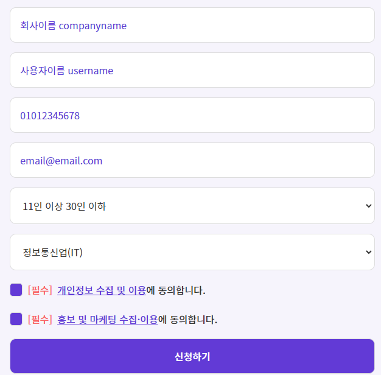
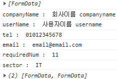

# flow-clone-coding
반응형 웹 디자인 및 javascript 적용 기본을 목표로 하는 클론 코딩 프로젝트입니다. <a href="https://juunie-roh.github.io/flow-clone-coding/"><i>확인하기</i></a>   
원본 페이지는 [*여기*](https://flow.team/kr/index, "flow KR") 에서 확인할 수 있습니다.   

Responsive breakpoints :
> **mobile :**   
> * under 600px (minor changes)
> * under 786px
> * from 787px to 1024px
>    
> **pc :**
> * from 1025px to 1440px
> * over 1441px

Active Pages :
> * index.html, 메인 페이지 (main)
>
> * pages/project.html, 제품 > 프로젝트 협업 페이지
> * pages/task.html, 제품 > 업무 관리 페이지
> * pages/chatting.html, 제품 > 메신저 페이지
> * pages/okr-introduction.html, 제품 > OKR 페이지
> * pages/video.html, 제품 > 화상회의 페이지

## Features

### 입력 정보 처리

*메인* 페이지의 *소개서 다운로드* 부분에서 입력한 정보 처리와 관련한 부분입니다.   

서버와 연동한 프로젝트가 아니므로 입력된 정보는 브라우저 개발자 도구 Console에 출력하도록 설정되어 있습니다.   
이 프로젝트에서는 입력된 정보를 아래와 같이 REST API 등으로 처리할 수 있도록 `FormData` 형태로 가공하여 저장합니다.

